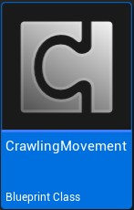
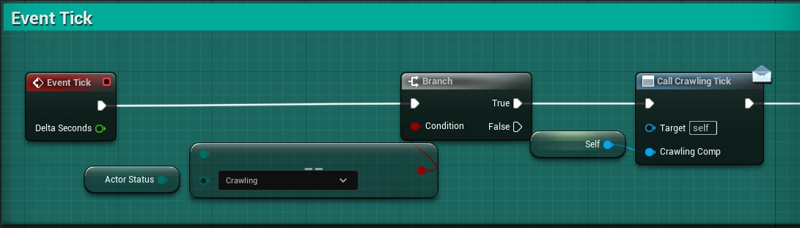
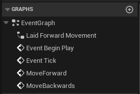
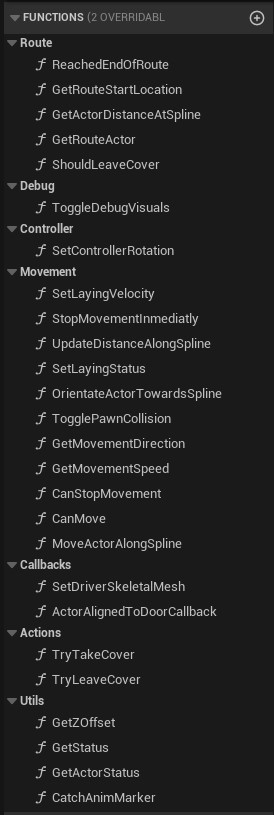
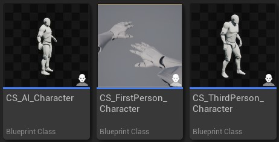
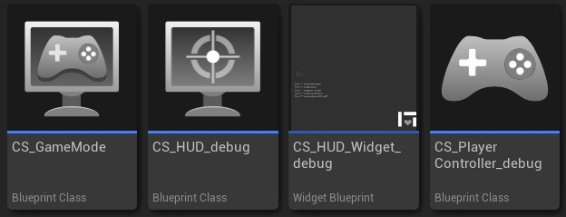

# Content reference

## Base route Actor
|Type|Blueprint Actor|
|File|CS_RouteActor|

The Route Actor is the main blueprint to create routes.

It provides a Spline component with a 2 Collision spheres, one on each side.

This collision spheres are used to enable/trigger the action to enter the route and start crawling along the Spline.

!!! note
    In this actor, **nothing should be manually edited** unless you have very specific needs. This is a base Actor to extend your custom ones from.
    Refer to the [Setup section](setup.md) to read more on implementing and customizing it into your game.

{ loading=lazy }

It also provides a few visual debugging elements:

- **Leave cover distance**: This box is a visual representation of the point where the Character will leave the route (stop crawling and come back to walking)
- **Leave cover location**: This arrow lets you see the location the Character will move when exiting the route. This is the exact location the Character will have when It comes back to walking.

### Configuration

The actor also provides configurable parameters that will allow you to modify those distances and locations.

{ loading=lazy }

- **Debug**: Enable visual debuggin of elements in-game
- **Bi directional route**: If true, exit side can be also used to enter the route, so player can pass through the route in both directions.
- **Route enabled**: Realtime activation/deactivation of the route.
- **Distance to frontdoor for leaving**: Distance until end of route for leaving cover
- **Distance to backdoor for leaving**: Distance until end of route for leaving cover
- **Backdoor exit location distance**: Distance from the back door location to place the player upon exit.
- **Frontdoor exit location distance**: Distance from the front door location to place the player upon exit.
- **Allow backward movement**: Enables/disables moving backwards along the route.

!!! note
    All this configuration should be customized in your own child Actors not in this Base one.
    Refer to the [Setup section](setup.md) to read more on implementing and customizing it into your game.

## Crawling Movement component
|Type|Blueprint Component|
|File|CrawlingMovement|

{ loading=lazy align=left }

The *Crawling Movement* component is the base element for this package, and It contains all the logics to handle state changes, movement when crawling and various events happening during that action.

It also provides a CrawlingTick that only "Ticks" when we are in Crawling State.
This is usefull to implement some logic that might be needed by the implementers.

It can only be added to Actors of type *Pawn* or children of It (like *Character*).

!!! tip
    The system provides some debug errors if the Component is not properly setup, like: "ERROR INIT01: The owner actor must be of type Pawn or a child of It"

### Internal implementation

The component is as self contained as possible, and follows the best practices.

Here you can see the composition of it Graph:

{ loading=lazy align=right }
{ loading=lazy align=left }

(Note the tick only runs when we are actively crawling)

Here you can see a piece of it's internal functions so that you can get an idea of it's implementation patterns:

{ loading=lazy }

## Example Characters

{ loading=lazy }

The package includes 3 example characters:
`CS_FirstPerson_Character`

:    This is the most elaborated character, as it includes not only movement behaviour but also an extra skeleton to handle crawling animations, camera effects and better transitions.

`CS_ThirdPerson_Character`

:    This character is a **simplified version of the First person** one.

    It provides the **minimal setup** to make the *Crawling Component* work.

    This is the best Character to look for implementation details, as it is the simplest and easier to understand.

`CS_AI_Character`

:    This is very **similar to the Third person character**, but it is made to work with AI instead of being controlled by players.

    The implementation only makes them always move forward. If they collide with a route entrance, they will go to crawling mode and continue moving forward until the reach the exit.

## Debuggin elements
|Type|Miscellaneous|
|File|Multiple|

The package comes with a few elements that are there just for showcase/debugging porpourses.

!!! note
    This elements can be safely removed, as they don not affect the *Crawling Mvoement* behavior.

Although, note that this tools are usefull during development phases for your games.

{ loading=lazy }

`CS_GameMode`
    
:    The only goal of this *Game Mode* is to configure all the required Classes for your game.

    It is used in the example map to set the HUD, Controller, etc for the showcase map.

`CS_HUD_debug`

:    This *HUD* class is used to retrieve the player crawling state/config and update it on the HUD_Widget.

`CS_HUD_Widget_debug`

:    This widget holds the texts to draw the different configuration options in the UI during gameplay.

    It is only used to show data. Does NOT interfere with any gameplay aspect.

`CS_PlayerController_debug`

:    This *Controller* only exists to allow debugging with new pawns on different views.

    It holds a binding to key "5" in your keyboard to toggle your pawn between First person and Third person views.

## Character state
|Type|Enum|
|File|CS_CharacterState|

The system comes with a state system that includes 4 states. This state is used by the Crawling Component so It won’t interfere with other movement states.

- **Crawling**: Is active when the player is already laying in the ground, ready to crawl/crawling.
- **Entering**: This state is active when the character is playing the entering sequence.
- **Exiting**: Same as “Entering” but when exiting.
- **Standing**: This state is active when the player is not in a Crawling System related state.

You could merge it with your own player state Enmu, but it should not be necessary, as the system is completly separated to other custom movements you could have.

## Door type
|Type|Enum|
|File|CS_DoorType|

Door is the name that the entrance and exit points of the route receive.

There are only 2 types of doors:  

- **Front Door**
- **Back Door**

This is used to determine varios behaviors, like the distance to front/back doors to leave the route when crawling or if the *Back Door* can be used to enter the route again (in backwards direction)

## Movement direction
|Type|Enum|
|File|CS_MovementDirection|

This Enum is used to determine the current movement direction. It is used by the *Animation Blueprint* to run it on the right direction.

The possible values are:

- **Forward**: When the character is moving (or willing to move) forwards
- **Backward**: When the character is moving (or willing to move) backwards
- **None**: When the Character is not moving at all

