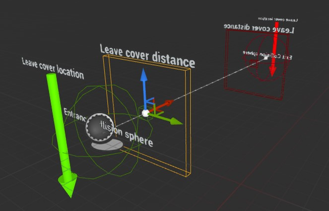
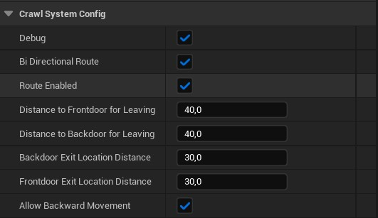

# Content reference

## Base route Actor
|Type|Blueprint|
|File|CS_RouteActor|

The Route Actor is the main blueprint to create routes.

It provides a Spline component with a 2 Collision spheres, one on each side.

This collision spheres are used to enable/trigger the action to enter the route and start crawling along the Spline.

!!! note
    In this actor, **nothing should be manually edited** unless you have very specific needs. This is a base Actor to extend your custom ones from.
    Refer to the [Setup section](setup.md) to read more on implementing and customizing it into your game.

{ loading=lazy }

It also provides a few visual debugging elements:

- **Leave cover distance**: This box is a visual representation of the point where the Character will leave the route (stop crawling and come back to walking)
- **Leave cover location**: This arrow lets you see the location the Character will move when exiting the route. This is the exact location the Character will have when It comes back to walking.

### Configuration

The actor also provides configurable parameters that will allow you to modify those distances and locations.

{ loading=lazy }

- **Debug**: Enable visual debuggin of elements in-game
- **Bi directional route**: If true, exit side can be also used to enter the route, so player can pass through the route in both directions.
- **Route enabled**: Realtime activation/deactivation of the route.
- **Distance to frontdoor for leaving**: Distance until end of route for leaving cover
- **Distance to backdoor for leaving**: Distance until end of route for leaving cover
- **Backdoor exit location distance**: Distance from the back door location to place the player upon exit.
- **Frontdoor exit location distance**: Distance from the front door location to place the player upon exit.
- **Allow backward movement**: Enables/disables moving backwards along the route.

!!! note
    All this configuration should be customized in your own child Actors not in this Base one.
    Refer to the [Setup section](setup.md) to read more on implementing and customizing it into your game.

## Character state
|Type|Enum|
|File|CS_CharacterState|

The system comes with a state system that includes 4 states. This state is used by the Crawling Component so It won’t interfere with other movement states.

- **Crawling**: Is active when the player is already laying in the ground, ready to crawl/crawling.
- **Entering**: This state is active when the character is playing the entering sequence.
- **Exiting**: Same as “Entering” but when exiting.
- **Standing**: This state is active when the player is not in a Crawling System related state.

You could merge it with your own player state Enmu, but it should not be necessary, as the system is completly separated to other custom movements you could have.

## Door type
|Type|Enum|
|File|CS_DoorType|

Door is the name that the entrance and exit points of the route receive.

There are only 2 types of doors:  

- **Front Door**
- **Back Door**

This is used to determine varios behaviors, like the distance to front/back doors to leave the route when crawling or if the *Back Door* can be used to enter the route again (in backwards direction)

## Movement direction
|Type|Enum|
|File|CS_MovementDirection|

This Enum is used to determine the current movement direction. It is used by the *Animation Blueprint* to run it on the right direction.

The possible values are:

- **Forward**: When the character is moving (or willing to move) forwards
- **Backward**: When the character is moving (or willing to move) backwards
- **None**: When the Character is not moving at all

