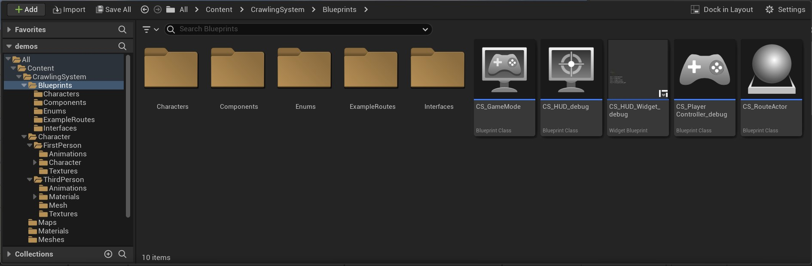

# Crawling System for Unreal Engine

🎉 The simplest yet porwerfull Crawling System for Unreal Engine 🎉

L|SUPPORT ON|https://discord.com/channels/685799359308365851/685799359765676064|.discord-icon|

The **Crawling System** for Unreal Engine is a framework that will empower you with a crawling system like the one seen in “Dead Space” or “Erie” games, allowing you to easily make paths that the player can “enter” and follow while crawling in the ground.  

This systems DO NOT allow to crawl freely on the game, but to follow a spline based path forward (or backwards) with some nice animations.

## Preview videos
::: youtube Nf-1ZlxaScM  

::: youtube 22P4r7rWidc

## Key features
- **Spline based** routes.
- 🚀 **Performant**.
- Debugging tools included.
- 💯 Follows best coding practices.
- Includes automated functional tests.
- 👓 Documentation + video & written tutorials
- First & Third person **character examples** + AI
- Compatible with ALS (Advanced Locomotion System v4)
- **IK hand placement** setup: Hands adapt to the ground height and rotation.
- Examples and caveats provided.
- **Ground detection**: No need to worry about pixel-perfec spline placement.
- 🚦 Double or single **direction routes**.
- Per instance **exit limit & location** configuration: Determine freely and independently where the character is going to take off of the route and where it is going to be located when character activates walking movement.
- Customizable behavior to enter the route, with examples provided.
- ⛔ **Forward and backwards movement**: Can be disabled per route instance and per character, at runtime.
- **Configurable speed** per character: Independent for moving forward/backward.
- Control camera movement from bone animations when crawling (optionally).
- 🧲 Movement animations always ensure **both hands are on ground** before stop moving.
- 🎮 Supports keyboard & controllers
- Configurable **Camera limits**.

## Package content

!!! note

    Since Unreal Engine **version 4.27+**, the Crawling System is a component based package, making it easy to integrate into any existing project by simply using interfaces and components.
    you can find the **legacy package documentation** in the following document: [Legacy documentation page](https://redirect.epicgames.com/?redirectTo=http://bit.ly/ue4-crawling-sys-docs)

{ loading=lazy }

* **Debuggin** tools included: Info Widgets, iconography, etc.
* **Core route** Actor: Allows interacting with the route path.
* Example **routes**: 2 Actors implementing the route path with different features configured.
* Example **Characters**: 
    * 2 **Player characters** with input bindings.
    * 1 **AI character** with basic movement functionality.
* **Interfaces** (1): Allows implementing the system on existing Characters.
* **Enumerations** (3):
    * Character state: Crawling/Entering route/etc.
    * Door definition: Front/Back door.
    * Movement direction: Forward/Backwards.

## Technical considerations

The system **only** uses tick events when actively crawling, and only to move the character in the proper direction. The Route Components **DO NOT use** tick events, so the number of instances will not impact your performance.

The animations for the first person Character arms can be used in production, but they are not optimal (the package focuses on functionality) which means that **the rig might not look good on other skeletons**. It is also slightly adjusted on rotation and position inside the implementer blueprints.
