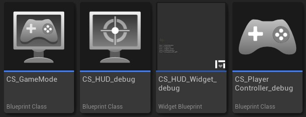

# Setup

This page holds the basic knowledge for the setup.

Please, note the sub-sections include specific guides on how to configure the package for existing projects.

## Non mandatory elements

The package comes with a few elements that are there just for showcase/debugging porpourses.

This elements can be safely removed, as they don not affect the *Crawling Mvoement* behavior.

Although, note that this tools are usefull during development phases for your games.

{ loading=lazy }

`CS_GameMode`
    
    The only goal of this *Game Mode* is to configure all the required Classes for your game.

    It is used in the example map to set the HUD, Controller, etc for the showcase map.

`CS_HUD_debug`

    This *HUD* class is used to retrieve the player crawling state/config and update it on the HUD_Widget.

`CS_HUD_Widget_debug`

    This widget holds the texts to draw the different configuration options in the UI during gameplay.

    It is only used to show data. Does NOT interfere with any gameplay aspect.

`CS_PlayerController_debug`

    This *Controller* only exists to allow debugging with new pawns on different views.

    It holds a binding to key "5" in your keyboard to toggle your pawn between First person and Third person views.
