# Integrating with ALS v4

This is a step by step guide to integrate the Crawling System for UE 4.24+ into any existing character.

For showcase porpurse, we will be integrating it into ALS v4 (Advanced Locomotion System)

This package is component based, so adding the required functionality to existing characters takes only a few steps and should not interfere with any existing code.

# Implementation
## 1. Crawling Movement component

This system includes a *Crawling Movement* component.

### Add the Crawling Movement component
You need to add it to your *Character* blueprint:

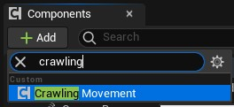{ loading=lazy }

The resulting component should look like this:

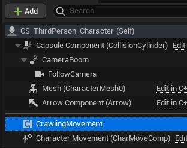{ loading=lazy }

### Initialize the component

This component requires one parameter for the initialization. The *Driver Skeleton*

This *Driver Skeleton* is the one that will implement the *Anim notify* events, so it is important that we set **the  one with the crawling animation**.

You can initialize it in the constructor of your character as follows:

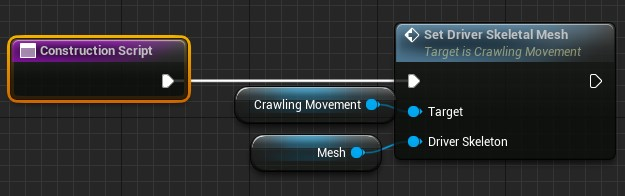{ loading=lazy }

## 1. Crawling interface

Crawling system uses BPI_CS_Pawn interface to handle functionallity, you need to add It to your ALS character

{ loading=lazy }

!!! note
    **Do not forget** to implement those methods. They are very simple and you can copy/paste them from the first/third person example characters provided in the Crawling System

## 2. Implement the interface methods

We implemented the interface but now we need to make It's methods work.

We are going to implement the following methods:

{ loading=lazy }

{ loading=lazy }

We can differentiate 2 colors on them:
`**Yellowish/Goldish**`

:   This are events that are executed on some conditions. For this case, they are triggered from the Crawlying Component that we will be adding later in this guide.

`**Greyish/Blueish**`

:   Functions that are used by the Crawling component to retrieve information from the Character Blueprint.

### Implementing the Events (yellowish/goldish color)

As said, this events will be triggered under certain circunstances. By default when the player should move to the route start or exit.

Because of this, we need to implement what the character will do what this happens.

!!! note
    This is implemented as an event that can be customized  per Character to allow any kind of character setup. 
    You have full control over what should happen regading moving to the right place + any other thing you might want to happen.

{ loading=lazy }

!!! note
    For ALS v4 you will need to calculate the height location based on the Capsule Component. See the image below for an example.
    { loading=lazy }

!!! tip "TIP: Split input pin"
    To show the 3 coordinates (X, Y, Z) as separated pins, you can right click on the *New Location* pin and select *Split Struct Pin*
    { loading=lazy }

### 3. Implement Crawling Input
The crawling system uses a very simple input setup, you just need to add the following (also can be copied from example characters)

!!! note "Input binding setup"
    This package does not include bindings, as it could potentially override already defined ones. Instead, you can find the file and how to set the required ones [in this page](./inputs.md)

For the Character to be able to move when in *crawling* state, you must fire the *MoveForward* and *MoveBackwards* events.

Here you can see an example setup, with the default input binding *InputAxis MoveForwardCrawling* for players:

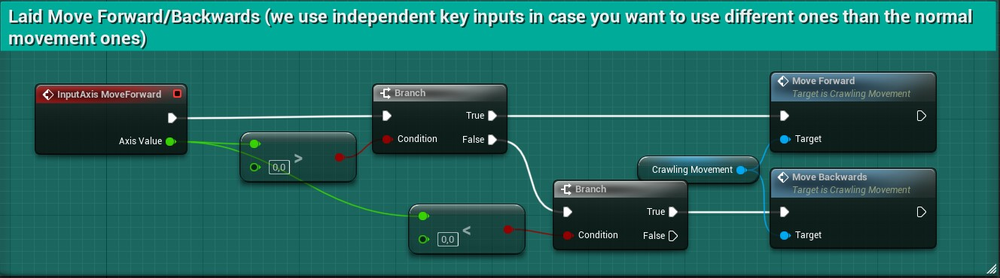{loading=lazy}

!!! note
    For AI characters, you must trigger the same methods (*MoveForward* & *MoveBackwards*) but probably you want to do so by a different event and not by an Input binding.

!!! warning
    This is not yet working! We need to disable other movement inputs and set the right movement mode.
    Continue reading to see how to do it.

### 4. Disable other movement types

When you are in Crawling mode, you should not trigger any other movement type.

To do so, we need to disable other types of movement bindings and to set the right movement mode in the *Character Movement component*

#### Listen to crawling state changes

The *Crawling Movement* component implements an event binding that allows you to react to changes on that state.

We will be creating a listener in our Character blueprint that allows triggering our own functionality in the Character:

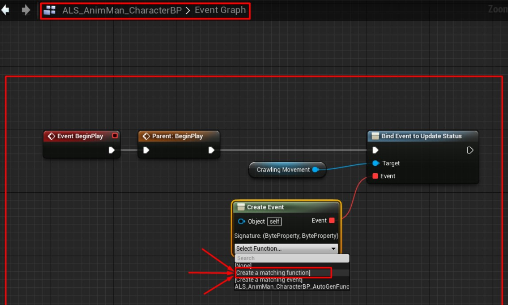{loading=lazy}

!!! note
    If you are not familiar with event bindings, you can:
    1. Place a reference to the Crawling Movement component
    2. Drag from its pin and add a *Bind Event to Update Status* node.
    3. Drag from the red *Event* pin in the *Bind Event to Update Status* node and add a new *Create Event* node.
    4.Click on the *Select Function* dropdown and click on *Create a matching function*

    This will create a new function on your blueprint that will be executed every time the *Update Status" event from the *Crawling Movement* component is triggered.

#### Set movement mode

Now that we have a function to listen for Crawling Movement state changes, we need to add our logic to disable other types of movements during the crawling.

This is how it should look for ALS v4:

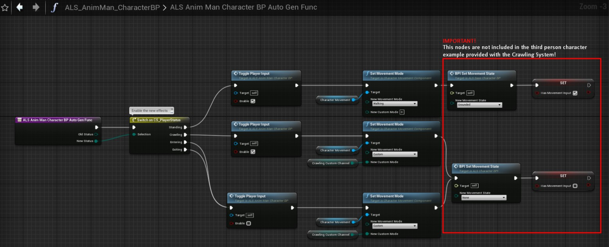{loading=lazy}

!!! note
    The nodes of the image above (inside of the red box) are related to ALS system only, so you don’t need to add them if you are not using ALS for this character (actually if you are not using ALS character, those nodes won’t even show up in the node selection help box)

!!! note "Toggle Player Input node"
    You will notice that the function “Toggle Player Input” does not exists in Unreal Engine. This is because It is just a helper function created by us.
    This function can be copied from the *Crawling System* Third Person Character, so you can copy/paste from there.
    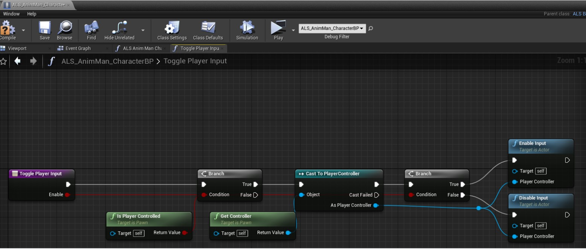{loading=lazy}

## 5. Retarget the crawling animation (optional)

!!! note
    This step is optional, as you might have your own crawling animations that don't require retargetting the provided one.

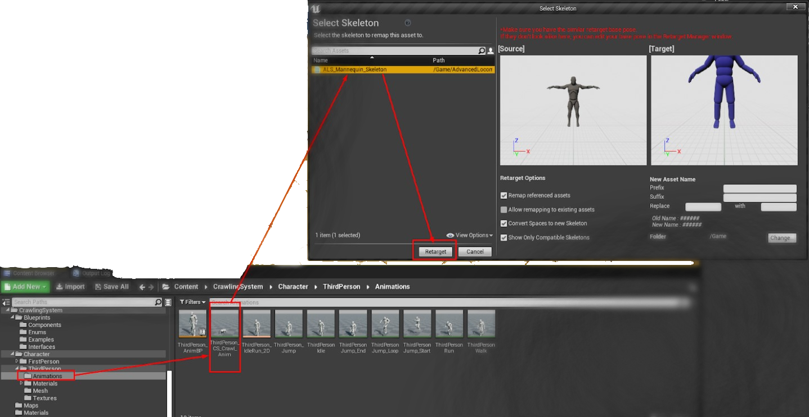{loading=lazy}

## 6. Setup your own animation (optional)

!!! warning "Animation notifies setup"
    If you want to use your own animation (and not do a retargetting as in step 5) this 6th step is mandatory.

The animation for the *Driver skeleton* (the one setup in the previous steps) need to have some notifies to ensure the *steps* are detected.

To do so, simply go to the animation editor and right click on the notifies track:

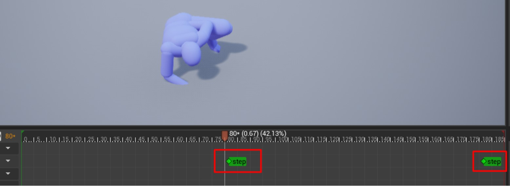{loading=lazy}

!!! note
    If you fail doing this, the character will never stop moving until it reaches the end of the path.

!!! warning
    If you use the provided animation with the pack, you will notice that the retargeted animation is not looking good at all in the ALS skeleton. This is due to the retaget tool and can be improved by tweaking manually some bone mapping on the base poses before retargeting. You can find guides on doing so in the Unreal Engine forums and documentation.

## 7. Setup the Animation Blueprint

!!! note
    ALS Anim BP is very complex, so we are not going to dig deeply into the system. For this tutorial we are going to make a whole new state that does not interfere with anything already setup in the example ALS Anime BP.

    !!! note "Not only ALS"
        This step is the same you should follow on any other *Character*

### 1. Set *Direction* and *CrawlingState* properties

The animation requires from a *Direction* and a *CrawlingState* properties to work properly.

The setup is very simple and can be done as in the following images:

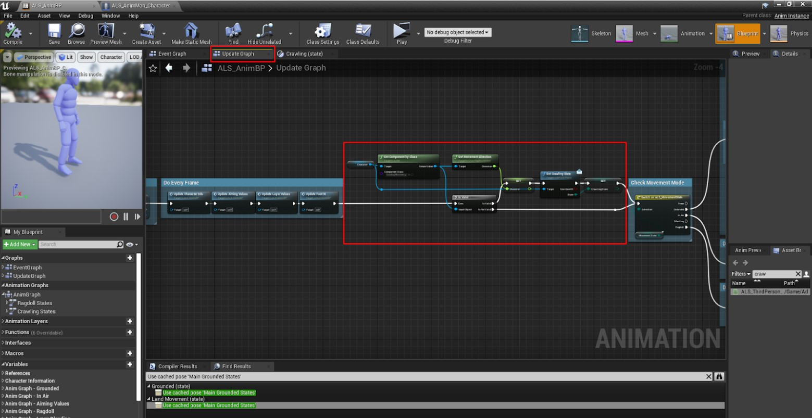{loading=lazy}
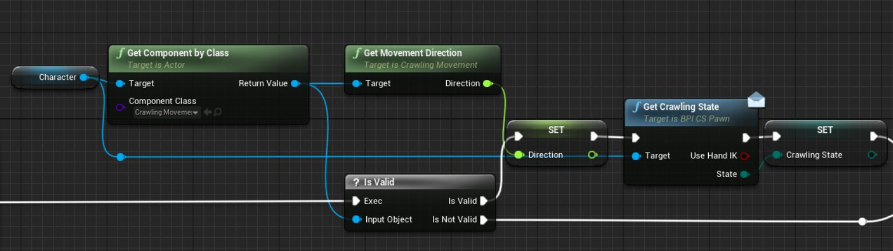{loading=lazy}

### 2. Create a new *State Machine*

Create a new *State Machine* and connect It **before** the output pose to a blend pose, using our *CrawlingState* vabialbe as filter.

!!! note
    This setup ensure that all the ALS things run properly when we are not crawling, and we just blend to our new Crawling *State Machine* when required.

!!! tip
    You can copy the “Ragdoll States” state machine and delete It’s content

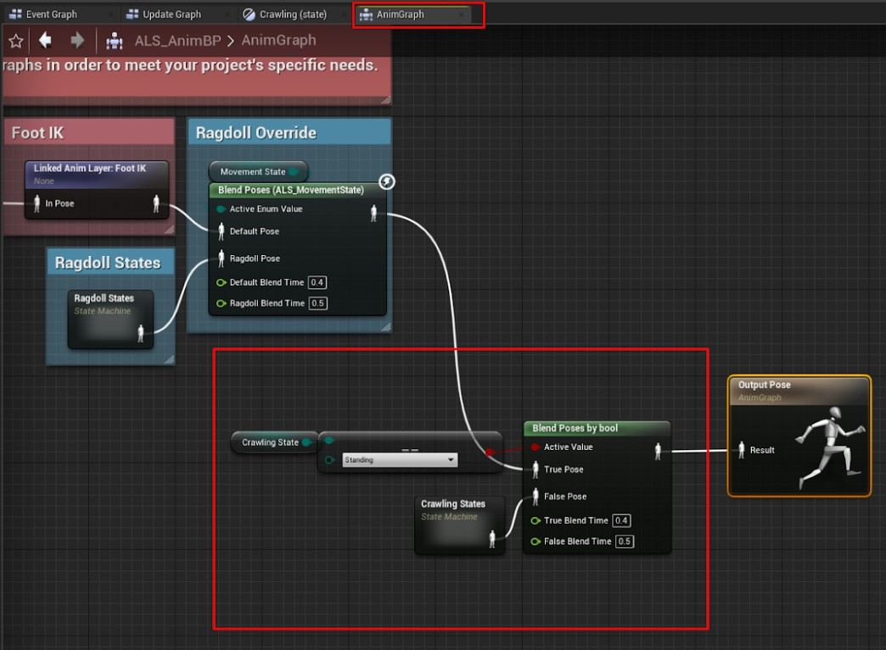{loading=lazy}

### 3. Populate the new *State Machine*

Add a new state in the *Crawling states* State Machine we have just created in the previous step.

The name for this state is not important.

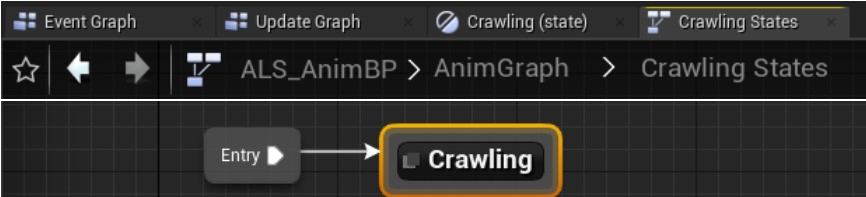{loading=lazy}

### 4. Add your Crawl animation to the *State Machine*

!!! info
    It is **VERY IMPORTANT** to set the sync group properly, as the image below shows

!!! note
    You must implement the *play rate* pin using the direction variable we declared earlier in this guide.

!!! warning
    If you do not do this step properly, you will either see the character never stopping when It enters the route or It will play the forward crawling animation always, even when you stop or go backwards.

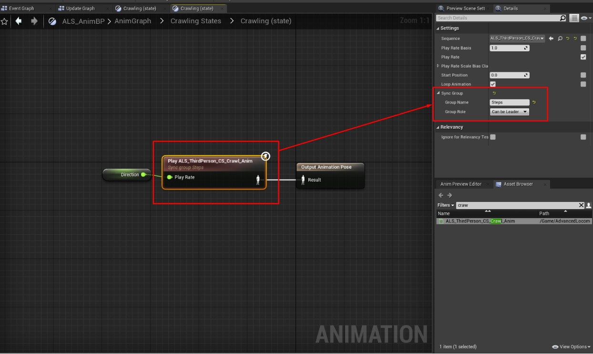{loading=lazy}

## 8. Set collisions for the skeleton

The Crawling System uses a line trace to determine where the ground is placed. 

We need to properly set collision channels to work as expected.

!!! warning
    By default, ALS skeletal mesh has the collision property *Block* checked for the channel *Visibility*. This will cause the Crawling System trace to collide with the mesh and return wrong locations, making the character look glitchy.

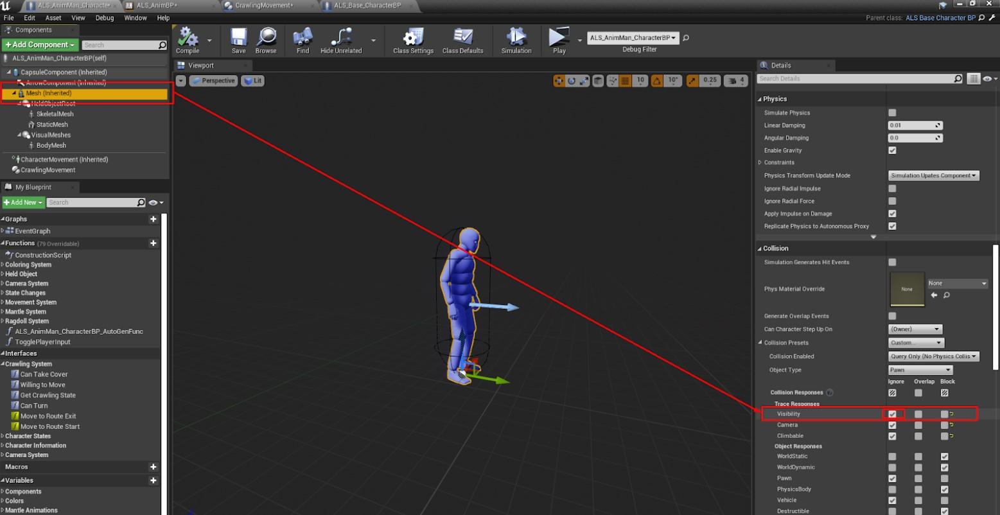{loading=lazy}

# Conclusion

This Guide can be used for any kind of custom character, as there are only a couple of details/nodes specific to ALS.

´The final result should look like the following:

::: youtube 22P4r7rWidc
