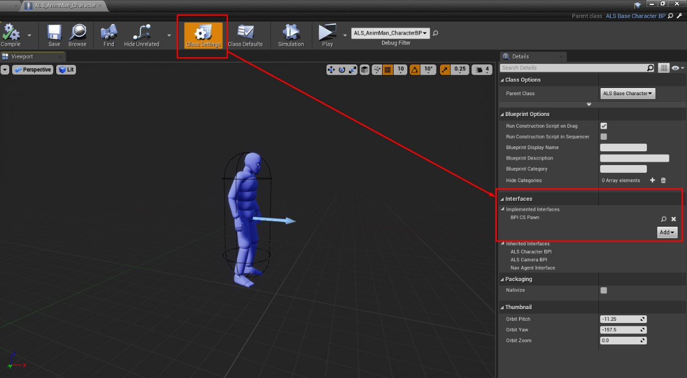
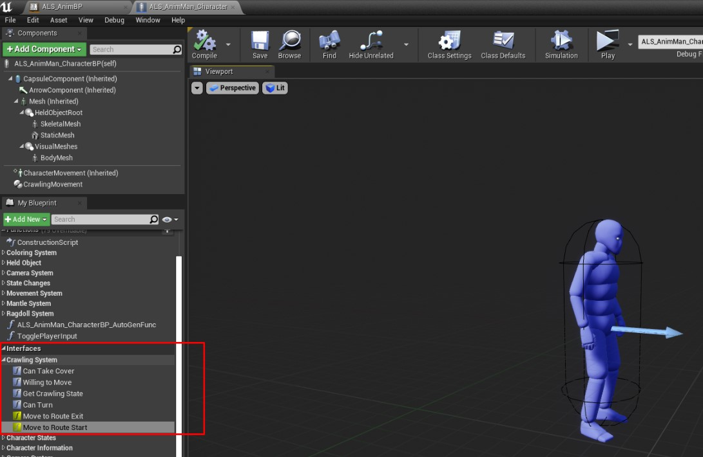
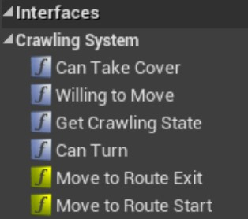
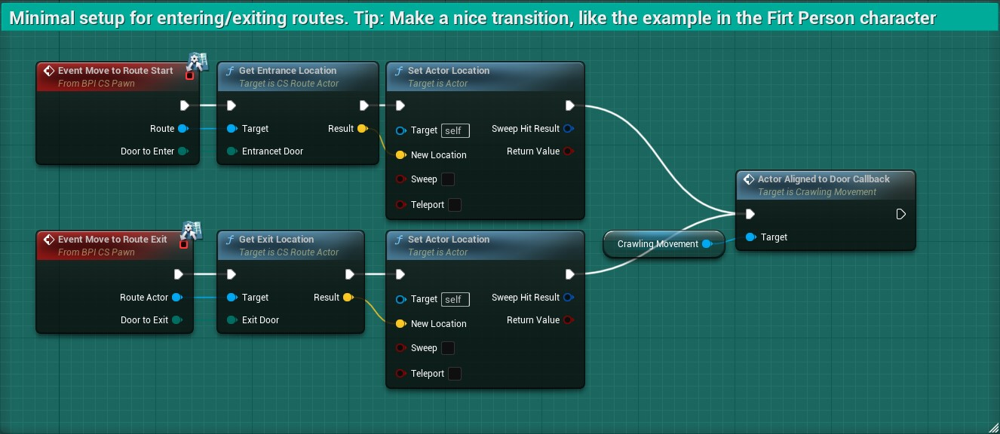
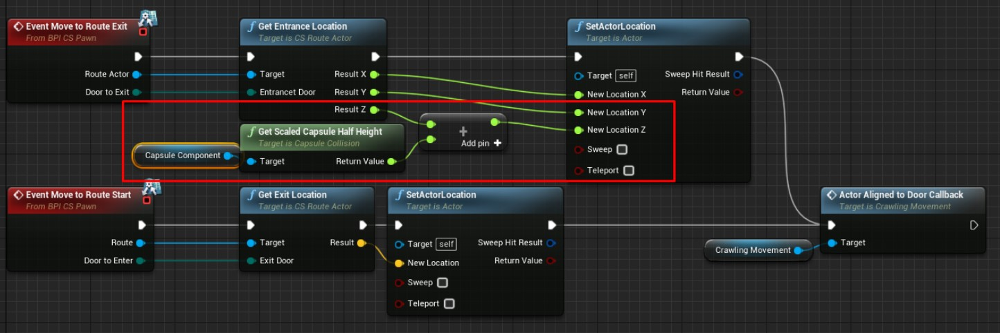
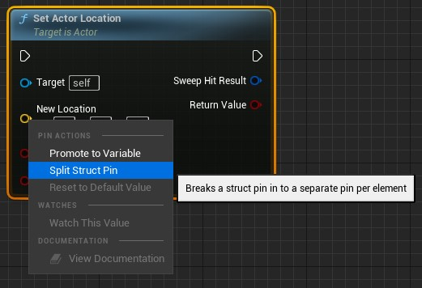

# Integrating with ALS v4

This is a step by step guide to integrate the Crawling System for UE 4.24+ into ALS v4 (Advanced Locomotion System)

# Implementation
## 1. Add the interface to ALS character

Crawling system uses BPI_CS_Pawn interface to handle functionallity, you need to add It to your ALS character

 { loading=lazy }

!!! note
    **Do not forget** to implement those methods. They are very simple and you can copy/paste them from the first/third person example characters provided in the Crawling System

## 2. Implement the interface methods

We implemented the interface but now we need to make It's methods work.

We are going to implement the following methods:

 { loading=lazy }

 { loading=lazy }

We can differentiate 2 colors on them:
`**Yellowish/Goldish**`

:   This are events that are executed on some conditions. For this case, they are triggered from the Crawlying Component that we will be adding later in this guide.

`**Greyish/Blueish**`

:   Functions that are used by the Crawling component to retrieve information from the Character Blueprint.

### Implementing the Events (yellowish/goldish color)

As said, this events will be triggered under certain circunstances. By default when the player should move to the route start or exit.

Because of this, we need to implement what the character will do what this happens.

!!! note
    This is implemented as an event that can be customized  per Character to allow any kind of character setup. 
    You have full control over what should happen regading moving to the right place + any other thing you might want to happen.

 { loading=lazy }

!!! note
    For ALS v4 you will need to calculate the height location based on the Capsule Component. See the image below for an example.
     { loading=lazy }

!!! tip inline "TIP: Split input pin"
    To show the 3 coordinates (X, Y, Z) as separated pins, you can right click on the *New Location* pin and select *Split Struct Pin*

 { loading=lazy }